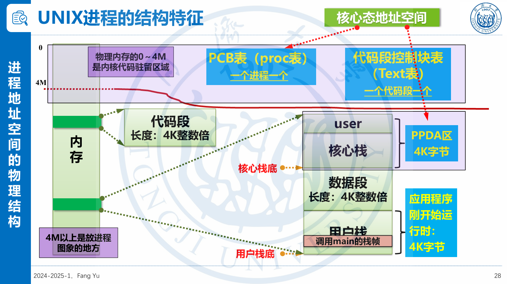
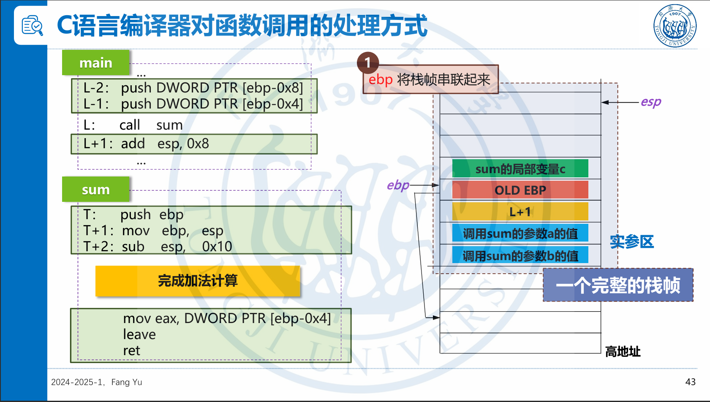
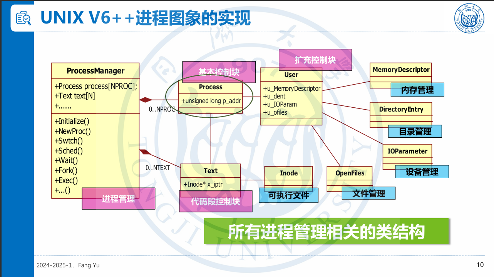
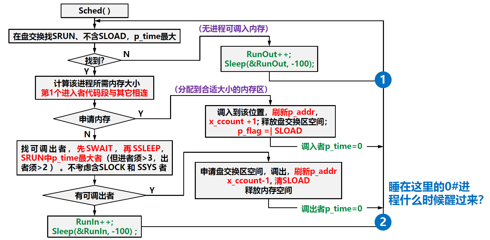

# UNIX

## 源代码->磁盘中的可执行文件

下面是一个典型的源代码：

```c
#include<fcntl.h>
char buffer[2048];
int version = 1;
main1(argc,argv)
int argc;
char* argv[];
{
    int a,b;
    ...;
    sum(a,b);
    exit(0);
}
int sum(var1,var2)
int var1,var2;
{
    int count;
    count = var1 + var2;
    return (count);
}
```

其由以下几部分组成：

1. 头文件`#include<fcntl.h>`
2. 全局变量：
   1. 未赋初值`char buffer[2048]`
   2. 赋初值`int version = 1`
3. `main1`函数
4. 形参`argc,argv,var1,var2`
5. 局部变量`a,b,count`

对应的可执行文件为

|内容 | 大小|
|--|--|
|magic number  |             |
|Text段长度信息1024        |         |
|Data段长度信息4        |            |
|BSS段长度信息2048    |         |
|Text段，包含main1()代码，sum()函数代码以及库函数代码|1K|
|Data段|4|

1. 这里的magic number以及长度信息统称为文件头。
2. 这里的Text段和Data段按需分配，不会以4K或其他大小为单位。
3. 这里的BSS是Block Started by Symbol的缩写
4. BSS段长度由未赋初值的全局变量大小决定
5. Data段长度由已赋初值的全局变量大小决定
6. Data段和BSS段可能因为链接的其他文件中的全局变量而更长

## 磁盘中的可执行文件->内存中的进程图像

需要经过以下步骤：

1. 打开文件，读入文件头
2. 分配Text段长度（向上扩展至4K的整数倍）的内存作为代码段
3. 从可执行文件中Text段读取代码段
4. 分配Data段和BSS段长度之和（向上扩展至4K的整数倍）的内存空间作为数据段并清0
5. 从可执行文件中的Data段读取Data段至数据段开头

局部变量和调用函数时所用形参在进程运行时动态存储在用户栈中。

下图为进程图像的总览（物理地址版本）



1. 用户自己编写的代码，如`main1,sum`以及库函数都属于用户态地址空间
2. 代码段若和PPDA区、数据段和用户栈一同调入内存中，则占用连续的内存空间
3. PPDA是Per Process Data Area的缩写
4. PPDA区，数据段和用户栈若内存不够则可以换出
5. Text段只有当没有在内存中的进程使用时才能换出

## 用户态

物理地址空间4M以上是用户态地址空间

### 用户栈

1. 用户栈从高地址至低地址扩展
2. 用户栈开始时大小为4K
3. 一个函数体对应一个栈帧，从高地址至低地址分别由以下部分组成：
   1. 形参
   2. 返回地址
   3. OLD EBP
   4. 局部变量



调用函数负责逆序压入形参（使得顺序靠前的形参离返回地址近），调用被调用函数（压入返回地址）；被调用函数负责压入OLD EBP，并更新EBP，和顺序放入临时变量。

返回时，被调用函数负责将用户栈还原至进入被调用函数之前的状态，所以需要还原ESP，EBP，弹出并装入EIP。调用函数需要负责删除实参区。

## 中断与核心栈

### 中断的基本流程

在用户态运行时，核心栈为空。当发生中断时，将会启用核心态内存空间。

当进程运行在用户态时，若发生中断，将会依次发生下列事件：

1. 中断隐指令（没有对应汇编语句，只有机器语言）
   1. 关中断
   2. 核心栈寄存器压入核心栈（若之前为用户态，压入SS，ESP，EFLAGS，CS，EIP；若之前为核心态，压入EFLAGS，CS，EIP）
   3. SS段转入核心态
   4. 查找并依据中断向量装入CS和EIP
   5. 跳转至中断处理入口程序（机器语言调用函数）
2. 中断处理入口程序
   1. SaveContext保存中断软件现场
   2. SwitchToKernel将DS和ES转向核心态
   3. 调用中断处理程序（汇编调用函数）
3. 中断处理程序
   1. 可能调用其他**内核态函数**
   2. 很可能会唤醒与本次中断相关的进程
4. 例行调度
   1. 若先前为用户态（根据硬件现场中的CS判断），则直接进一步通过RunRun判断是否需要调度
   2. 若为内核态，进行下一步
5. 恢复中断前现场
6. 中断返回

机器语句和汇编调用函数与C语言调用函数的区别在于，C语言调用函数的语句转为汇编语句时，会自动添加压入形参的语句，但是前面两者不会。这给予了自由操作栈帧的操作。对于跳转至中断入口程序，由于不需要形参，所以不作处理。对于中断处理程序，通过SaveContext来形成所需要的形参。

### 时钟中断

每秒会由于可编程定时芯片触发60次定时中断。

1. 时钟中断处理程序之前与中断的基本流程一致
2. 使用时钟中断处理程序
   1. 若为用户态，当前进程u_time+1，否则当前进程u_stime+1
   2. 当前进程p_cpu+1，上限为1024
   3. Time::lbolt+1
   4. 若Time::lbot<60或中断前为核心态，则发送EOI
   5. 否则
      1. Time::lbolt-60
      2. Time::time+1
      3. 发送STI和EOI并开中断
      4. 唤醒所有延时睡眠进程（因为Sys_sleep睡眠的进程），`WakeUpAll((unsigned long)&Time::tout)`
      5. 所有进程p_time++
      6. 所有进程p_cpu=max(0,p_cpu-SCHMAG)
      7. 重新计算所有优先数p_pri大于PUSER，即在用户态的进程的进程，的优先级p_pri
      8. 如果RunIn设置，则清除标志，并唤醒0#进程
      9. 如果收到信号，则进行信号处理
      10. 重新计算当前进程优先级p_pri
3. 例行中断

### 系统调用中断

与中断的基本流程在于中断处理程序为系统调用处理程序Trap

1. 根据系统调用号获取处理子程序入口表
2. 执行系统调用处理子程序
   1. 可能会执行读文件等IO操作
3. 重算现进程优先数p_pri

一个调用与外设IO相关的系统调用的进程的运行状态变化如下：

1. 使用内嵌汇编调用系统调用函数
2. 执行系统调用处理函数Trap
   1. 执行系统调用处理子函数
      1. 使用外设
      2. 调用Sleep入睡
         1. 用Swtch切换进程
3. 被唤醒
4. 被Swtch选中上台
5. 执行剩余处理子函数和处理函数
   1. 在Trap末尾重算进程优先数
      1. 为了刷掉核心态下的优先级，恢复计算获得的优先数
      2. 现运行进程优先级下降，设置RUnRun
6. 例行调度
   1. 执行Swtch下台
7. 被Swtch选中上台
   1. 退出中断

## 调度

### p_cpu

1. p_cpu代表着进程使用cpu的时长，包括用户态和核心态所用时间
2. 每次脉冲都会更新当前进程的p_cpu
3. 每60次脉冲将每个p_cpu减去一个魔数
4. 范围在0-1024

### p_pri

1. 利用p_cpu计算
2. 只会在三个时刻利用p_cpu计算：
   1. 每60个脉冲对p_cpu>PUSER的进程重新计算
   2. 每60个脉冲对当前进程重新计算
   3. Trap末尾对当前进程重新计算
3. 会在下列时刻赋予特殊值
   1. 因使用外设睡眠时
      1. 高优先权赋予p_pri范围[-100,0)内的值
      2. 底优先权赋予p_pri范围[0,100)内的值
   2. 调用Sleep睡眠，置为90
   3. 新进程赋予p_pri为0
   4. wait系统调用将进程p_pri置为40

### 调用Swtch

可能会在以下时机调用Swtch

1. 中断
2. 系统调用（访问外设时，在Sleep函数中调用Swtch）
3. 例行调度
   1. 需要先前态为用户态
   2. RunRun!=0
      1. SetPri函数体内若新pri>现运行进程上台时的优先数Curpri，则更新RunRun
      2. WakeUpAll中，若被唤醒进程p_pri<Curpri，则更新RunRun

### 选新进程

1. 将RunRun置为0
2. 从**上次查找到的进程的后一个位置开始线性扫描**，找图像在内存的优先级最高的就绪进程。

## 结构体定义



### Process类

Process类常驻内存，其中保存的变量是无论进程是否在内存中，都有可能要访问的。例如进程的状态。

重要成员有：

1. p_addr
2. p_textp
3. p_state
4. p_flag
5. p_cpu
6. p_pri
7. p_wchan

### Text类

重要成员有：

1. x_daddr
2. x_caddr
3. x_size
4. x_count
5. x_ccount

### User类

重要成员有：

1. u_rsav
2. u_procp
3. u_MemoryDescriptor
4. u_ar0
5. u_arg

### ProcessManager

重要成员有

1. process[]
2. text[]
3. CurPri
4. RunRun

## 内核态函数

### Swtch函数

Swtch函数负责进程调度，有以下步骤：

1. 保存现场：
   1. 将esp，ebp保存至u_rsav中
2. 将运行进程改为0#进程
   1. 为0#进程创建核心态页表
   2. 用0#进程的u_rsav数组恢复esp和ebp
3. 调用select函数选新进程
4. 将现运行进程改为新进程
   1. 为新进程建立核心态页表
   2. 用新进程的u_rsav数组恢复esp和ebp
5. 若新进程有SSWAP标志
   1. 用新进程的u_ssav[2]数组再次恢复esp和ebp
6. 返回1

在这一过程中EIP不变，所以三个进程共享同一段Swtch代码

### Select函数

由Swtch函数调用，用于选择新进程

1. 将RunRun置零
2. 从上次查找到的进程位置开始线性循环扫描proc数组，找到图像在内存，且优先级最高的就绪进程
3. 若没有找到，则执行hlt指令等待中断
4. 更新CurPri，即本次进程上台时所用的优先级
5. 更新本次找到的进程在proc结构中的下标
6. 返回指向该proc结构的指针

### Sleep

用于让进程睡眠，接收参数为睡眠原因和睡眠时的优先数。
非抢占式下台，例如调用外部设备时，是先调用Sleep然后再调用Swtch下台。
所以非抢占式调度下台的进程的核心栈栈顶为Swtch栈帧和Sleep栈帧，而抢占式调度的栈帧只有Swtch栈帧和一次中断相应的栈帧（若无中断嵌套）

1. 以高优先权睡眠
   1. 关中断
   2. 设置睡眠原因
   3. 将状态更改为高优先数睡眠SSLEEP
   4. 设置优先数
   5. 开中断
   6. 调用Swtch
2. 若以低优先权睡眠，且没有信号则
   1. 关中断
   2. 设置睡眠原因
   3. 修改状态为低优先级睡眠SWAIT
   4. 设置优先数
   5. 如果RunIn被设置，则清除RunIn标志，然后唤醒0#进程
   6. 调用Swtch

### SetPri

负责重算p_pri，并设置RunRun，流程如下

1. 计算p_pri
2. 如果新p_pri大于现运行进程占用CPU时的优先数，更新RunRun
   1. 这使得每秒钟RunRun必定会被更新
   2. Trap函数末尾RunRun一定会被更新

调用SetPri的时机有三处：

1. 每60次心跳，对所有优先数大于PUSER的使用setpri
2. 每60次心跳处理末尾调用对当前进程调用setpri
3. Trap末尾

之所以设置当新p_pri大于现运行进程占用CPU时的优先数，更新RunRun，是因为在上述三个时机分别能起到下述作用：

1. 每60次心跳后必会设置RunRun，使得后续使用Swtch进行调度
2. 由于每60次心跳之后的处理时间较长，额外重新计算当前进程的p_pri，由于RunRun在之前已经更新了，所以并没有用
3. 将核心态的优先数更新为用户态的优先数，并更新RunRun

### WakeUpAll

用于唤醒由于指定原因睡眠的进程，所需参数为睡眠原因。流程如下

1. 遍历所有PCB
2. 判断是否由于指定原因睡眠
   1. 是则调用SetRun唤醒

### SetRun

流程如下：

1. 清除睡眠原因
2. 修改状态，**不改变优先数**
3. 如果被唤醒进程优先级高于现运行进程，设置RunRun
4. 如果RunOut!=0并且进程图像在磁盘中，则清除RunOut标志，并唤醒0#进程

### NewProc

NewProc用于创建新进程，流程如下：

1. 父进程esp,ebp保存至u_rsav中
2. 为子进程申请复制虚页表
3. 若内存分配成功
   1. 子进程复制父进程图像，子进程的p_addr指向该内存
   2. return 0

注意这里是c语言调用c语言

子进程后续会被Swtch调度，Swtch除了恢复esp，ebp外，还会return 1。虽然子进程一开始的核心栈顶端是NewProc的栈帧，但是EIP指向的是Swtch的代码。当执行return 1时，会视为NewProc的返回值，并撤销NewProc的栈帧，同时弹出的返回地址是NewProc之后的地址。

对于父进程，返回值则是0.

### Swap

用于在内存和盘交换区之间交换进程图像。

在Sched中，若像调入进程图像则直接调用Swap。

### XSwap

用于在Sched中换出进程图像，主要步骤如下：

1. 调用Swap将PPDA区换出至盘交换区中
2. 释放PPDA区占用的内存
3. 如果RunOut被设置
   1. 清除RunOut标志，唤醒0#

### Sched

0#进程一直在执行Sched



1. 会因为RunOut睡眠，原因是**在盘交换区上无就绪进程**
   1. SetRun中会更新RunOut，并唤醒0#，这是因为唤醒的进程在盘交换区上，变成就绪进程
   2. XSwap中更新RunOut，这是因为有新进程进入盘交换区

## 设备缓存管理

### 状态

#### B_DELWRI

延迟写标志

#### B_ASYNC

异步IO标志

#### B_WANTED

有进程在等待使用该BCB管理的缓存

#### B_BUSY

说明该缓存已被分配，正在使用中

#### B_ERROR

IO因出错而终止

#### B_DONE

说明该缓存块的IO任务已完成

#### B_READ

读操作

#### B_WRITE

写操作

### 状态改变时机

1. `GetBlk`中，如果不可重用，则要清空之前的信息，并置`B_BUSY`；如果可重用，要置`B_BUSY`；如果等待其他缓存，要置**被等待的BCB**为`B_WANTED`；如果要异步写回，要置`B_ASYNC`
2. `Brelse`中只会保留`B_DONE`,`B_WRITE`,`B_READ`,`B_DELWRI`，清除其他标志
3. `Bread`中，若不能重用，会置`B_READ`
4. `IOdone`中，置`B_DONE`，清`WANTED`，可能因为出错置`B_ERROR`
5. `Bwrite`中，清空`B_READ`,`B_DONE`,`B_DELWRI`,`B_ERROR`
6. 延迟写中，添加`B_DONE`,`B_DELWRI`

### 队列

每个缓存块同时位于两个队列中。NODEDEV队列或某一设备队列，以及自由队列或某一I/O请求队列。

1. 初始时：NODEV队列和自由队列
2. 读写时：设备队列和I/O请求队列
3. 结束时：设备队列和自由队列

| 队列名称  | 队列特点    | 缓存块类型 | B_DELWRI | B_ASYNC | B_WANTED | B_BUSY | B_ERROR | B_DONE | B_READ | B_WRITE |
|-------|---------|-------|----------|---------|----------|--------|---------|--------|--------|---------|
| NODEV | 只有一个    | 与设备无关 | \        | \       | \        | \      | \       | \      | \      | \       |
| 自由队列  | 只有一个    | 曾IO   |          |         |          |        |         | 有      |        |         |
| 设备队列  | 每类设备有一个 | 曾IO   | "延迟写“时有  | ”异步“时有  | “等重用”时有  | 无      | 出错时有    | 有      | 两者有其一  |         |
|       |         | 正在IO  | 无        | ”异步“时有  | “等重用”时有  | 有      | 无       | 无      | 两者有其一  |         |
| IO队列  | 每类设备有一个 | 正在IO  |          |         |          | 有      |        |       | 两者有其一  |         |

### 队列改变时机

1. `GetBlk`中，会将返回的`BCB`从自由队列中摘下；若不可重用，还要更换所在的设备队列
2. `Brelse`中，会将进程置于自由队列末尾
3. `Bread`中，若不能重用，将BCB送入请求队列队尾；若能重用，送入自由队列队尾
4. `IOdone`中，若无错，会摘下自由队列中的第一个BCB
5. `Bwrite`中，将BCB送入请求队列中
6. 延迟写中，将BCB释放至自由队列队尾
7. 异步读释放缓存

## 设备读写技术

### `GetBlk(dev,blkno)`

接受参数为IO设备和虚拟块号，用于读写操作时申请缓存块。流程如下：

1. 在`dev`对应设备队列中寻找含`blkno`对应块的缓存
2. 找到：
   1. 若含`B_BUSY`
      1. 置`B_WANTED`，进程因指向缓存块的指针入睡
      2. `goto`在`dev`对应设备队列中寻找含`blkno`对应块的缓存
   2. 若不含`B_BUSY`
      1. 从自由队列取出，置`B_BUSY`，并将其置于IO队列末尾
      2. 返回指向缓存块的指针
3. 没找到：
   1. 若自由队列为空：
      1. 置自由队列队头`B_WANTED`
      2. 因空闲队列队头入睡
      3. `goto`在`dev`对应设备队列中寻找含`blkno`对应块的缓存
   2. 若自由队列非空：
      1. 摘下自由队列队首缓存块，置`B_BUSY`
      2. 若含`B_DELWRI`:
         1. 置`B_ANSYC`
         2. 调用`Bwrite`
         3. `goto`在`dev`对应设备队列中寻找含`blkno`对应块的缓存
      3. 若不含`B_DELWRI`:
         1. 请空除`B_BUSY`以外的标志
         2. 更新缓存块`dev`，`blkno`信息
         3. 插入新设备队列队头
         4. 返回指针

**返回的缓存控制块均带`B_BUSY`，若可以直接重用，则还带`B_DONE`**

**`GetBlk`只会作必要的操作，其最终目的是提供一个可供调用进程所使用的BCB，需要带有B_BUSY标志，因此，如果遇到带有B_DELWRI标志的进程，需要将其异步写回磁盘，继续循环。同时，为了维持自由队列的LRU性质，需要将返回的BCB从中摘下，但是进一步处理交给后续调用的函数解决。如果不可重用，也要将BCB插入新设备队列中，并清除其他标志，因为其中的内容已经没有意义，对应的IO过程的信息也没有意义了**

### 读操作

UNXI实现的读文件都是同步方式，流程如下：

1. 调用`GetBlk`申请缓存
2. 根据返回的缓存控制块进行IO操作
3. 返回给文件系统含有所需内容的缓存块
4. 文件系统读取所需内容
5. 调用`Brelse`释放缓存

### 写操作

UNIX实现的写操作都是异步写，流程如下：

1. 若写入的起始位置为逻辑块的起始地址，并且写入字节数为512，则
   1. 调用`Getblk`申请缓存
   2. 将用户地址空间内容写入缓存
   3. 异步写
2. 若不满足，则：
   1. 先调用`Bread`将涉及到的内存部分读入缓存中
   2. 将用户地址空间内容写入缓存
   3. 若写至缓存末尾：
      1. 使用延迟写
   4. 否则：
      1. 使用异步写

### 预读

若上次读的时第i块，这次读i+1块，则会调用`Breada`而非`Bread`来进行正常读取+预读。

`Breada`的流程如下：

1. 使用`Bread`同样的流程读入缓存
2. 若无法重用内存块：
   1. 预读下一块
      1. 若可重用，则直接释放
      2. 若不可重用，则异步读，在中断处理中直接释放

### 入睡时机

1. 在`GetBlk`中因为无空闲缓存而入睡
2. 在`GetBlk`中因为等待其他进程而入睡
3. 在`IOwait`中因为等待IO操作而入睡

### 唤醒时机

1. 在`Brelse`中唤醒因为无空闲缓存入睡的进程
2. 在`Brelse`中唤醒因为等待正在释放的进程而入睡的进程
3. 在`IOdone`中唤醒因为等待IO操作而入睡，以及等待该进程进程而入睡的进程

## 设备读写相关函数

### `Bread(dev,blkno)`

`read`系统调用时调用，由文件系统得到`dev`和`blkno`，用于按照同步方式将字符快读入内存，然后将指向缓存控制块的指针交给文件系统。流程如下

1. 调用`GetBlk(dev,blkno)`
2. 如果含`B_DONE`:
   1. 让文件系统直接使用该缓存
   2. 将该内存块从IO队列摘下，放入自由队列队尾
3. 如果不含`B_DONE`:
   1. 置`B_READ`，更新`b_wcount`为`BUFFER_SIZE`
   2. 调用`Strategy`
   3. 调用`IOWait`
4. 返回指向缓存控制块的指针

### `Strategy`

被`Bread`调用，流程如下：

1. 将缓存送入IO队列队尾
2. 若磁盘空闲：
   1. 调用`Start`
3. 返回

### `Start`

被`Strategy`调用，流程如下：

1. 若IO队列非空：
   1. 将队首缓存对应设备置为忙
   2. 启动磁盘执行IO请求
2. 返回

### `IOWait`

用于等待IO操作结束，流程如下

1. 因指向缓存控制块的指针进入高优先级睡眠

### `ATAHandler`

在IO结束后的中断响应中调用，流程如下

1. 清除缓存控制块的忙标志
2. 如果出错，且次数小于10，则重新调用`Start`
3. 若没有错，则从IO队列中摘下队头，调用`IOdone`
4. 调用`Start`以启动IO队列中的下一个请求

### `IOdone`

在IO结束后的中断响应中调用，流程如下

1. 置`B_DONE`
2. 如果`B_ASYNC`:
   1. 调用`Brelse`
3. 如果没有`B_ASYNC`:
   1. 清`B_WANTED`
   2. `WakeUpAll(bp)`
4. 返回

### `Bawrite`

用于异步写，流程如下：

1. 置`B_ASYNC`
2. 调用`Bwrite`

### `Bwrite`

用于写操作，流程如下：

1. 清空`B_READ`,`B_DONE`,`B_DELWRI`,`B_ERROR`
2. 更新`b_wcount`
3. 启动设备驱动
4. 将缓存控制块送入IO队列
5. 如果没有`B_ASYNC`:
   1. 调用`IOWait`等待写操作
   2. 调用`Brelse`
6. 返回指向缓存控制块的指针

**写操作与读操作的区别之一在于写操作调用了`Brelse`，因为写操作结束后，文件系统不再需要缓存中的数据**

### `Bdwrite`

用于延迟写，流程如下：

1. 置`B_DELWRI`和`B_DONE`
2. 调用`Brelse`

### `Brelse`

用于释放缓存

1. 如果有`B_WANTED`，则`WakeUpAll(bp)`
2. 自由队列队头有`B_WANTED`，则清除`B_WANTED`，调用`WakeUpAll(Free)`
3. 清除`B_WANTED`,`B_BUSY`,`B_ASYNC`，保留`B_DELWRI`,`B_WRITE`,`B_READ`,`B_DONE`
4. 置缓存控制块于自由队列队尾
5. 返回